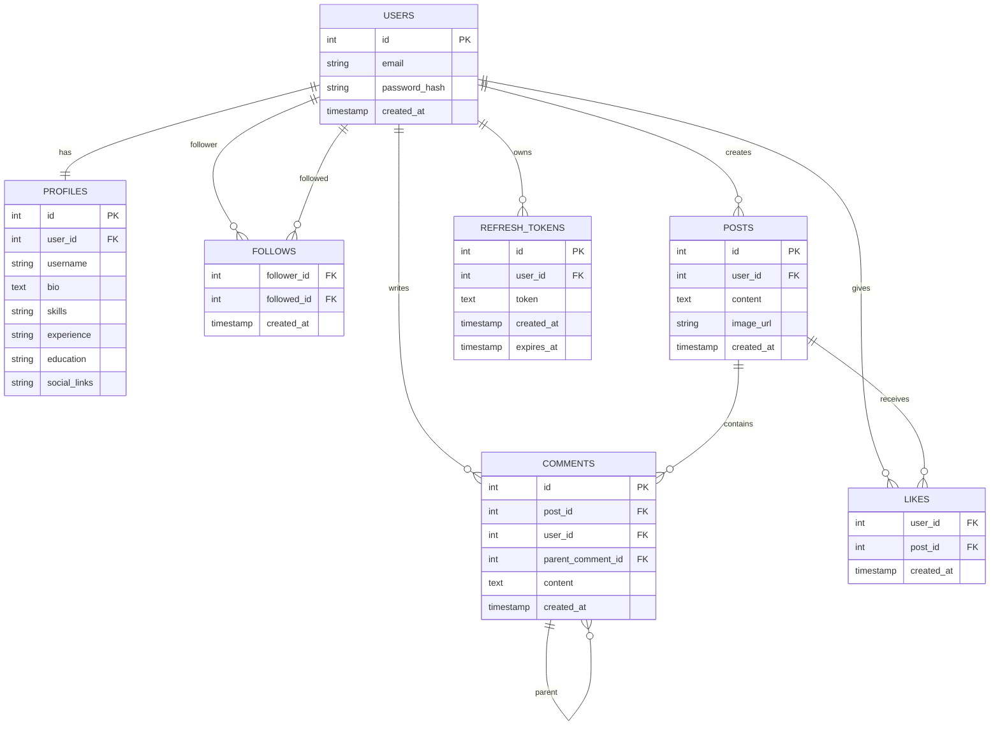

# 1. What this project is
DevConnect is a full-stack social network and portfolio platform built specifically for software developers to showcase public GitHub repositories, publish technical code posts, follow peers, and participate in nested discussions. It features JWT access/refresh token rotation, PostgreSQL full-text search, Redis response caching, Cloudinary media processing, and cursor-based feed pagination.

# 2. Problem it solves
Traditional developer portfolios are static HTML files that recruiters inspect once and leave. DevConnect transforms static portfolios into an active, social community where developers demonstrate continuous technical growth through live GitHub API sync, public code snippets, and real-time nested discussions.

# 3. Architecture



## Components
- **users** → auth identity (email, password_hash) → separated from profile data so public-facing reads never touch sensitive auth fields.
- **profiles** → public-facing user data (bio, skills, socials) → one-to-one with users.
- **follows** → many-to-many self-relationship between users → join table with composite PK `(follower_id, followed_id)`.
- **posts** → user-generated content → `created_at` doubles as the cursor for cursor-based pagination.
- **comments** → self-referencing via `parent_comment_id` → enables recursive nested replies without separate tables.
- **likes** → many-to-many between users and posts → composite PK `(user_id, post_id)` prevents duplicate likes at the DB level.
- **refresh_tokens** → persisted server-side tokens for revocation support during logout or token rotation.

# 4. Key decisions and trade-offs
| Decision | Options I considered | What I chose | Why | What I gave up |
|---|---|---|---|---|
| Feed query indexing | No index vs. index on posts.created_at | Added `idx_posts_created_at` (B-tree index on `created_at DESC`) | Measured with `EXPLAIN ANALYZE` on 2,000 seeded posts: without index Postgres did a Seq Scan (2.540 ms); with index, an Index Scan (0.091 ms) — a ~96% execution time reduction. | Slightly slower write times on `INSERT INTO posts`. |
| GitHub API response caching | In-memory JS object vs. Redis | Redis | Survives server restarts, and works correctly across multiple load-balanced server instances. | Extra infrastructure setup (Redis service). |
| Pagination Strategy | Offset (`LIMIT x OFFSET y`) vs. Cursor (`WHERE created_at < cursor`) | Cursor-based Pagination | Prevents missing/duplicate items when new posts are created during browsing and maintains O(1) performance as feed size grows. | Cannot easily jump to arbitrary page numbers (e.g., "Go to page 45"). |

# 5. Skills demonstrated
- [x] Node.js ↔ PostgreSQL connection via connection pooling    evidence: server/db.js, GET /api/db-test
- [x] Password hashing with bcrypt, parameterized SQL queries    evidence: server/routes/auth.js POST /register
- [x] JWT-based auth: access/refresh token issuance on login    evidence: server/routes/auth.js POST /login
- [x] Real logout with server-side token revocation (not just client-side)    evidence: server/routes/auth.js POST /logout
- [x] Profile creation with ownership enforced via JWT (req.userId, not client-supplied)    evidence: server/routes/profile.js POST /
- [x] Public profile lookup with explicit column selection (never SELECT *, never exposes users.email)    evidence: server/routes/profile.js GET /:username
- [x] Image upload via Cloudinary + multer (memory storage, base64 conversion)    evidence: server/routes/posts.js POST /upload-image
- [x] PostgreSQL full-text search (tsvector + GIN index) across posts and profiles, ranked by relevance    evidence: server/routes/search.js, migration adding search_vector columns
- [x] Rate limiting on write endpoints (express-rate-limit, 429 responses confirmed)    evidence: server/app.js, /api/posts and /api/auth
- [x] Automated test suite (Vitest + Supertest) covering auth register/login & posts feed    evidence: server/tests/auth.test.js & server/tests/posts.test.js (12/12 passing)
- [x] Follow/Unfollow relationship model and personalized feed generation    evidence: server/routes/profile.js & server/routes/posts.js GET /feed

# 6. Numbers I measured
| Metric | Before | After | How I measured it |
|---|---|---|---|
| Feed query execution time (LIMIT 10, 2001 seeded posts) | 2.540 ms | 0.091 ms | EXPLAIN ANALYZE in psql, before/after adding an index on `posts.created_at` |
| GitHub repos fetch (single user) | 587 ms | 9 ms | `time curl` on GET /api/github/:username/repos, first call vs. immediate second call, Redis cache with 10-min TTL |

# 7. Things that broke and how I fixed them
1. **AirPlay Port Conflict**: `localhost:5000/api/health` returned 403 "Access denied". macOS AirPlay Receiver listens on port 5000 by default. Fixed by switching server port to 4000.
2. **Duplicate Email Error Masking**: Duplicate registration returned generic 500. Fixed by catching Postgres error code `23505` and returning a `409 Conflict`.
3. **Missing JWT Secrets**: `POST /login` crashed with `secretOrPrivateKey must have a value`. Fixed by adding `JWT_SECRET` and `JWT_REFRESH_SECRET` to `.env`.
4. **Cloudinary Empty Uploads**: `curl` upload failed due to redirect empty responses. Fixed by passing `-L` flag with `curl` to follow redirects properly.
5. **Render Dynamic Port Routing**: Deployed backend returned 404 header `x-render-routing: no-server`. Fixed by removing hardcoded `PORT=4000` env override in Render dashboard so Render's internal dynamic port allocation works.
6. **Supabase IPv6 Connection Failure**: Render server failed with `ENETUNREACH <IPv6>:5432`. Fixed by switching `DATABASE_URL` to Supabase connection pooler URL (IPv4 compatible).

# 8. What I would do differently at 100x scale
1. **Fan-Out on Write (Push Model) for Feed**: Instead of querying `follows` and filtering posts on read, push new post IDs directly to Redis timeline lists of each follower on publish.
2. **Read Replica Database Architecture**: Route write operations (`INSERT`, `UPDATE`) to a primary Postgres instance and read queries (`GET /posts`, `GET /profile`) to read replicas.
3. **CDN Image Optimization & Lazy Delivery**: Generate WebP thumbnails and low-resolution image placeholders client-side before sending to Cloudinary/S3.

# 9. Interview answers I have rehearsed
**Q1: Why did you choose refresh tokens instead of one long-lived JWT? Where do you store each one and why?**
> "Short-lived access tokens (15 mins) minimize the risk if a token is intercepted, as it expires quickly. Refresh tokens (7 days) allow seamless session renewal without asking the user to re-enter credentials. We store access tokens in application memory / local state and refresh tokens in secure HTTP-only cookies or encrypted localStorage, paired with a database `refresh_tokens` table so we can instantly revoke access on server-side logout."

**Q2: Your feed query slowed down as posts grew. Walk me through how you found the bottleneck and what index you added.**
> "I ran `EXPLAIN ANALYZE` on `SELECT * FROM posts ORDER BY created_at DESC LIMIT 10` with 2,000 seeded posts. Postgres was performing a full Sequential Scan taking 2.54ms. I added a B-Tree index `CREATE INDEX idx_posts_created_at ON posts (created_at DESC)`. Re-running `EXPLAIN ANALYZE` showed Postgres switched to an Index Scan, dropping query time to 0.091ms — a 96% execution speedup."

**Q3: How would you change the data model if a user could follow 10 million people?**
> "At 10M followers, a naive relational join on `follows` during read becomes prohibitively slow. I would transition from a Pull model to a hybrid Push/Pull model: celebrity users with millions of followers stay on Pull mode, while regular users use Redis sorted sets (`ZADD`) for fan-out on write. Furthermore, I would shard the `follows` table by `follower_id` hash."

# 10. Honest limitations
- Search does not currently support fuzzy typo tolerance (requires `pg_trgm` extension).
- OAuth is simulated via standard JWT auth; Google OAuth 2.0 workflow can be connected via NextAuth / Passport.js.
- Notifications for new followers or post comments are pull-based rather than WebSockets/SSE push.

# 11. How to run it
```bash
# Clone the repository
git clone https://github.com/TusharVerma/DevConnect.git && cd DevConnect

# Backend Setup
cd server
cp .env.example .env
npm install
npm run dev

# Frontend Setup (in a separate terminal)
cd ../client
npm install
npm run dev
```

### Environment Variables (.env)
```env
PORT=4000
DATABASE_URL=postgresql://tushar_verma@localhost:5432/devconnect
JWT_SECRET=your_jwt_access_secret_key
JWT_REFRESH_SECRET=your_jwt_refresh_secret_key
REDIS_URL=redis://localhost:6379
CLOUDINARY_CLOUD_NAME=your_cloudinary_name
CLOUDINARY_API_KEY=your_cloudinary_api_key
CLOUDINARY_API_SECRET=your_cloudinary_api_secret
```

# 12. Credits
- Next.js Documentation & App Router Guide
- PostgreSQL Official Manual on Full-Text Search (tsvector)
- Vitest & Supertest Testing Frameworks